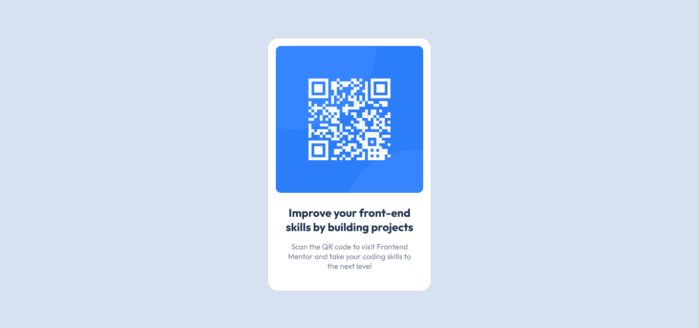

# Frontend Mentor - QR code component solution

## Welcome! 👋

This is a solution to the [QR code component challenge on Frontend Mentor](https://www.frontendmentor.io/challenges/qr-code-component-iux_sIO_H). Frontend Mentor challenges help you improve your coding skills by building realistic projects.

## Table of contents

- [Overview](#overview)
  - [Screenshot](#screenshot)
  - [Links](#links)
- [My process](#my-process)
  - [Built with](#built-with)
  - [Useful resources](#useful-resources)
- [Author](#author)
- [Acknowledgments](#acknowledgments)

## Overview

A perfect first challenge if you're new to HTML and CSS. The card layout doesn't shift, so it's ideal if you haven't learned about building responsive layouts yet.

### Screenshot

### Links

- [Solution](https://www.frontendmentor.io/solutions/my-first-html-and-css-solution-using-bootstrap-shvj6XFKS4)
- [Live Site URL](https://eyelin.github.io/QR-code-component/)

## My process

### Built with

- Semantic HTML5 markup
- CSS custom properties
- Bootstrap

### Useful resources

- [Figma](https://www.figma.com) - This is a powerful tool that helps developers to have better access to the designs and have the ability to extract information about typography, redlines, colors, measurement and more.
- [PerfectPixel](https://chrome.google.com/webstore/detail/perfectpixel-by-welldonec/dkaagdgjmgdmbnecmcefdhjekcoceebi) - Chrome extension that helps you to match the pixels of the provided design.

## Author

- Frontend Mentor - [@Eyelin](https://www.frontendmentor.io/profile/eyelin)

## Acknowledgments

A big thank you to Frontend Mentor and the community!
